# Diagrama de Classes (Toyota Tech)

> Diagrama de Classes do Projeto Integrador Toyota Tech, contendo atríbutos e métodos das respectivas classes.

***

1. **Cliente:**

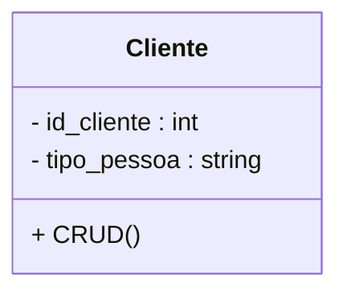

2. **Endereco:**

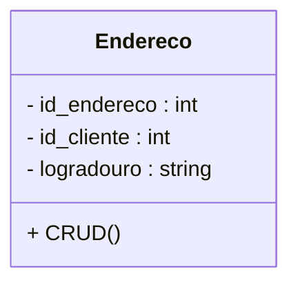

3. **Telefone:**

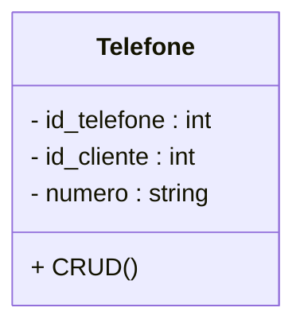

4. **Email:**

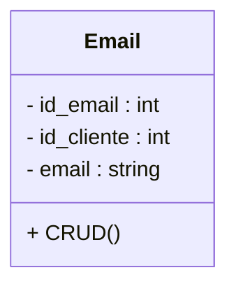

5. **Veículo:**

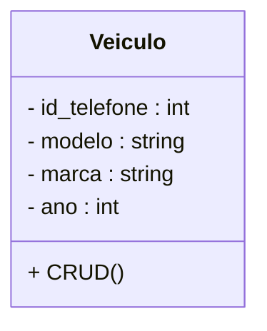

6. **Pedido:**

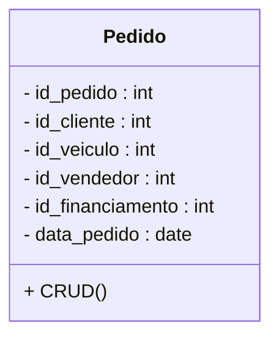

7. **Conta:**

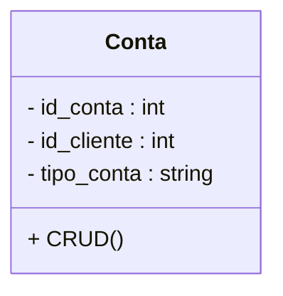

8. **Pagamento:**

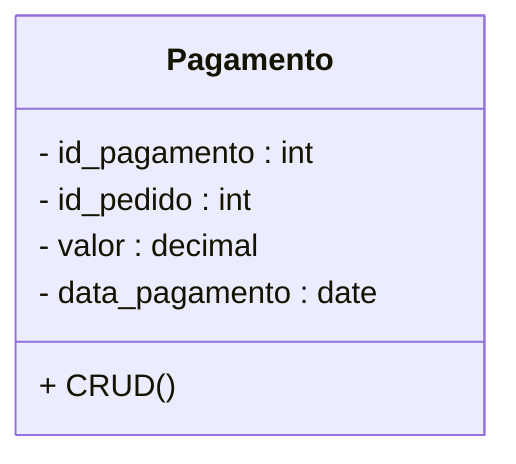

9. **Financiamento:**

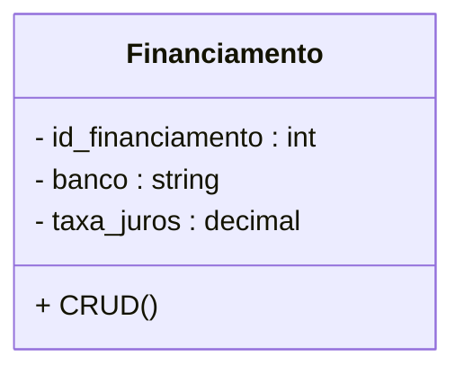

10. **Vendedor:**

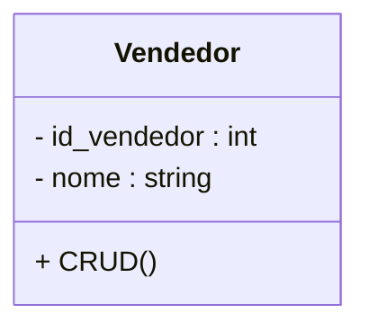

11. **Concessionaria:**

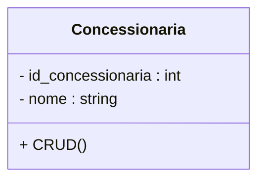